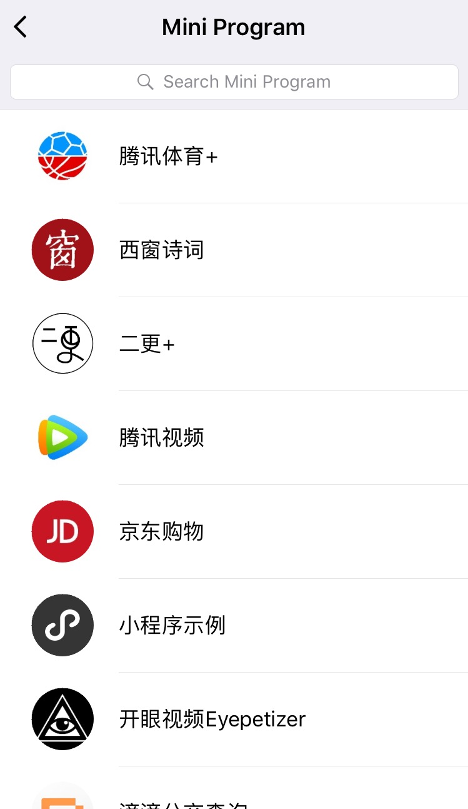

# Tidbits by Chujian Xiao'er (15)

## Joke

2017年1月9日是iPhone发布十周年纪念日。让我们先来做一个游戏：在第一代iPhone发布时，谁发表了图片中的言论？


小二简单地介绍一下选项中的5位大咖，他们分别是：

```
A. Laryy Ellison, co-founder and CTO of Oracle
B. Steve Ballmer, former CEO of Microsoft
C. Jeff Bezos, founder and CEO of Amazon
D. Sergey Brin, co-founder of Google
E. Shin Jong-Kyun, president and CEO of Samsung
```

揭晓答案的时刻到了：请在旋转锁定的状态下，将手机旋转180度，查看图片。

在答案中，谷歌的Sergey Brin开心地搂着前微软CEO鲍尔默说：占据移动端操作系统80%的市场份额是一个好主意。因为Google的Android系统已实现了这一个目标，而微软在移动端却没有延续他们在PC时代的辉煌。

同日，另一个重大事件就是腾讯小程序(mini program)的正式上线。选择在这个日期，是致敬还是挑战呢？大家的小程序体验如何？欢迎给小二留言哦。下图是小二使用过的一些小程序。



---

## 小二分享

在上一篇分享中，小二提到了美式橄榄球中，最重要的一场比赛：Super Bowl. 下图就是今年超级碗的logo:


大家知道图片中的"LI"是什么意思？

没错，它是罗马数字(roman number). 再进一步问，大家能识别出它代表的是第多少届超级碗吗？

如果不认识这个数字，也没关系。因为这就是本期小二分享的主题：*How to read Roman numbers like a Roman*?

虽然，我们平时使用的是阿拉伯数字，但在一些重大体育赛事的logo上, 以及一些古老的建筑上，我们都不难发现罗马数字的身影。小二之前也一直搞不清楚这些罗马数字@_@|||。但了解之后发现，其实它的规则还是很简单的。

纽约市政厅上的罗马数字：


### Rule 1
首先，我们先来看一下罗马数字中的基本符号，以及它们所代表的值：


所有的罗马数字都是由以上的基本符号组合而成的，大家一定要牢记。它们就相当于阿拉伯数字中的0-9.

### Rule 2
一般情况下，一个罗马数字的值是由组成它的数字符号的值从左向右相加得出的。

For example:
```
II = (1+1)= 2
XXX = (10+10+10) = 30
LII = (50+1+1) = 52
MMLVII = (1,000+1,000+50+5+1+1) = 2,057
```

不难发现，在以上的例子中，数字符号都是按照从大到小的顺序，从左向右排列出现的。但在现实生活中，遇到的数字，并不总是这样，比如说IV(4), I(1)比V(5)小，但它出现在了V的左边。这时，就要适用下一条规则了。

### Rule 3

如果，一个代表较小数值的符号，出现在代表较大的数值的符号的左边，则应将它的值从这个较大的值中减去。

For example:
```
XXIX = (10+10+(10-1)) = 29
CCCXCIX = (100+100+100+(100-10)+(10-1)) = 399
CDXLIV = ((500-100)+(50-10)+(5-1)) 444
```

So easy, 对不对？了解了以上这三条基本规则，我们就可以从容应对日常碰到的绝大数罗马数字了。

### Quiz Time
请大家识别以下的罗马数字：
```
1. MMCMXXXIX = 2939?
2. MMMCMLXXVII = 3977?
3. MMMDCCLXXIIV = 3773?
```
<br/>
<br/>
<br/>
<br/>
<br/>
<br/>
<br/>
<br/>
<br/>
<br/>
### Answers:
```
1. 23939; 2. 3977; 3773.
```
大家都答对了吗？

Happy MMXVII!
Until next time.

从本期开始，小二还会把所有的文章托管在GitBook上。点击“阅读原文”， 前往GitBook.
