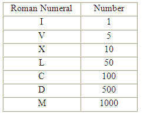

# Tidbits by Chujian Xiao'er (15)

## Joke

1月9日是iPhone发布十周年纪念日。让我们先来做一个游戏：是谁在第一代iPhone发布时，谁发表了图片中的言论？
选项中的5位大咖分别是：

```
A. Laryy Ellison, co-founder and CTO of Oracle
B. Steve Ballmer, former CEO of Microsoft
C. Jeff Bezos, founder and CEO of Amazon
D. Sergey Brin, co-founder of Google
E. Shin Jong-Kyun, president and CEO of Samsung
```


在旋转锁定的状态下，将手机选装180度，揭晓答案。谷歌的Sergey Brin开心地搂着前微软CEO鲍尔默说：占据移动端操作系统80%的市场份额是一个好主意。因为Google的Android系统已实现了这一个目标，而微软在移动端却没有延续他们在PC时代的辉煌。

同日，另一个重大事件就是腾讯小程序(mini program)的正式上线。选择在这个日期，是致敬还是挑战呢？大家的小程序体验如何？欢迎给小二留言哦。下图是小二使用过的一些小程序。

---

## 小二分享

在上一篇分享中，小二提到了美式橄榄球中，最重要的一场比赛：Super Bowl. 下图就是今年超级碗的logo:


大家知道"LI"是什么意思？没错，它是罗马数字(roman number). 大家知道它代表的是第多少届超级碗吗？这就是本篇分享的主题：How to read Roman number like a Roman?

虽然，我们平时使用的是阿拉伯数字，但在一些重大体育赛事的logo, 以及一些古老的建筑上，我们都不难发现罗马数字的身影。小二之前也一直搞不清楚这些数字到底是多少。其实，它的规则还是简单的。

纽约市政厅上的罗马数字：


首先，我们先来看一下罗马数字中的符号，以及他们代表的值：



所有的罗马数字都是由以上的符号组合而成的。

Rule 2
所有的罗马数字都是由以上数字符号从左向右相加得出的。
II = 2
XXX (10+10+10) = 30
LII (50+1+1) = 52
MMLVII (1,000+1,000+50+5+1+1) = 2,057

Rule 3

在以上的罗马数字中，数字符号都是按照从大到小的顺序，从左向右排列的。如果，一个代表较小数值的符号，出现在代表较大的数值的符号的左边，则应将它的值从这个较大的值中减去。


29 = XXIX (10+10+(10-1))
399 = CCCXCIX (100+100+100+(100-10)+(10-1))
444 = CDXLIV ((500-100)+(50-10)+(5-1))

So easy, 从此以后，我们再也不怕见到罗马数字了。
Happy MMXVII!

http://www.artofmanliness.com/2014/08/27/even-when-not-in-romeyou-should-know-your-roman-numerals/
http://www.roman-numerals.org/quizzes.html
