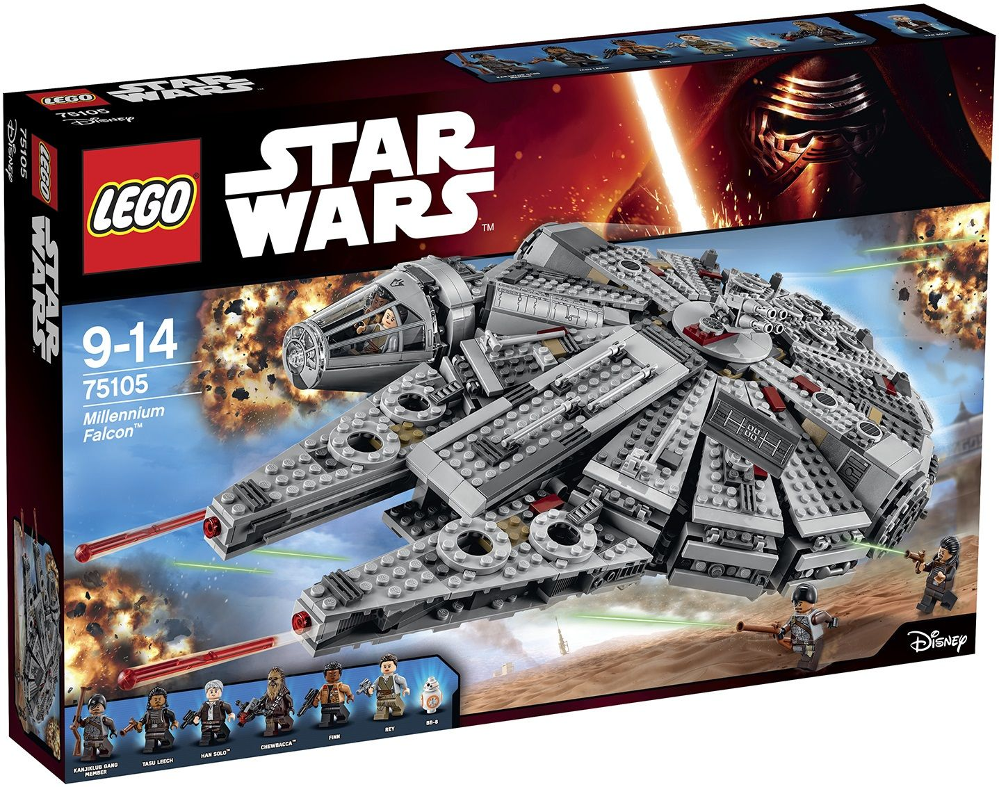
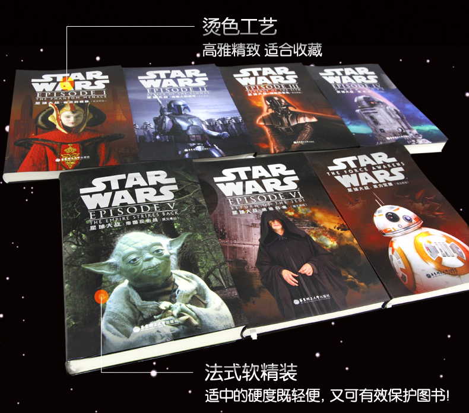
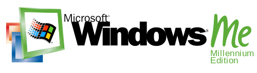
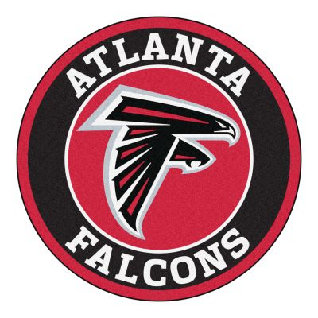

# Tidbits by Chujian Xiao'er (16)

## Music Time

今天推荐的是林志炫的歌曲中，小二最喜欢的一首，名字叫《大人物》，曲子朗朗上口，歌词也诙谐幽默。我们每一个人一定都是某些人眼中的“大人物”，你是谁的大人物呢？

## Tidbits

上周，在我们的微信群里，有两位妈妈聊到了星球大战版的乐高玩具：千年隼。Star Wars与Lego恰好也是小二感兴趣的，小二就接着她们的话茬，和大家聊聊。

### About Lego

我想群里的爸爸妈妈们给孩子买过Lego的，一定不在少数。购买时，大多数人的感觉就是一个字：贵。但不知道家长朋友们中有多少人，和孩子一起完成过一件乐高作品。如果您曾亲身参与到乐高的搭建过程中，那么对它的感受可能就成了另外一个字：值。

在小二看来，乐高玩具能够锻炼孩子以下几个方面的能力：

#### 1. 阅读说明书的能力 (instruction reading ability)
Lego的说明书叫building instruction, 没有任何文字，都是由图片组成的。孩子们在搭建一件作品时，需要根据说明书，在头脑中建立一个从二维图片到三维物体的映射(2D/3D mapping),这对他们是一个挑战。

#### 2. 眼力 (eyesight)
一个不可拆分的乐高零件叫一个piece，从一大包pieces中，找出当前步骤中需要的那一个，对孩子的眼力是一个考验。

#### 3. 耐心 (patience)
一个乐高作品，少则需要几步，多则需要几十步，甚至上百部才能完成，非常考验孩子们的耐心。

#### 3. 细心 (carefulness)
某些零件一不留神就可能被放置在错误的位置上，整个搭建过程都需要非常细心，集中注意力。

#### 4. 精细动作的能力 (fine motor skill)
在我们看来，乐高玩具在拼砌时的手感已经相当好了，但孩子们有时却要费九牛二虎之力才能把两个零件搭在一起。如果碰到搭错的时候，还需要将两个零件拆开，对他们来说就更困难了。这时，能够灵活使用起件器(brick separator)会很有帮助。小二的动手能力很差，一直以手残星人自居，可能就是小时候这方面的能力锻炼得比较少的缘故。

每一个乐高玩具都有一个编号，凭借这个编号，我们可以很容易的在乐高的官网找到这个玩具的页面。就拿千年隼来举例吧，打开<https://shop.lego.com>，一般会自动跳转到乐高美国官网。在右上角的搜索框中输入75105，然后回车，我们就可以打开千年隼的页面了。它的英文名字叫Millennium Falcon, 售价是149.99美元, 有1329个零件。在这个页面还可以下载它的building instruction, pdf格式，以后我们再也不用担心说明书丢失或损坏了。小二打开它的说明书看了一下，需要104步才能搭建完成。

### About Star Wars

第一部星战电影上映于1977年，小二没想到它在当今的孩子们中间还如此的受欢迎，魅力不减。其实，小二对星战并不是很了解，所有的星战电影都没有全看完。为了能够跟上小朋友们的步伐，小二决定补上这一课，哈哈。小二发现了一套由华东理工大学出版社出版的书：

1. 星球大战1：幽灵的威胁（英文原版）Star Wars: The Phantom Menace
1. 星球大战2：克隆人的进攻（英文原版）Star Wars: Attack of the Clones
1. 星球大战3：西斯的复仇（英文原版）Star Wars: Revenge of the Sith
1. 星球大战4：新希望（英文原版）Star Wars: A New Hope
1. 星球大战5：帝国反击战（英文原版）Star Wars: The Empire Strikes Back
1. 星球大战6：绝地归来（英文原版）Star Wars: Return of the Jedi
1. 星球大战7：原力觉醒（英文原版）Star Wars: The Force Awakens

这套书引进自著名的学乐公司(Scholastic Corporation), 是星战电影的novelization, 也就是根据电影写成的小说，而且它是国外的青少年读物，非常适合我们阅读。

下面是该套书第一本的链接：<http://www.ecustpress.cn/book/9989.html> 感兴趣的家长朋友们可以打开这个链接，然后点击“在线阅读”，就会打开一个pdf文件，能够试读部分章节。每本书的开头都包含大量的电影剧照，介绍书中的主要人物，制作还是很精美的。

### About Millennium and Falcon

最后，再聊一下Millennium和Falcon这两个单词。

Microsoft在2000年时发布了一个操作系统，叫Windows ME, 小伙伴们还记得吗？又暴露年龄了，哈哈。ME其实就是Millennium Edition的缩写，这样的首字母缩写词叫acronym. 比如，我们经常挂在口头的：VIP (Very Important Person), CEO (Chief Executive Officer), etc.

在今年的第51届Super Bowl中，那支被New England Patriots悲催地在加时赛逆转的球队就叫Atalanta Falcon（亚特兰大猎鹰）。

哦，对了，最后提醒大家一下，有一部乐高电影将在3月3日首映：The Lego Batman Movie.

That's all for today. Thanks for reading. 
May the force be with you.
