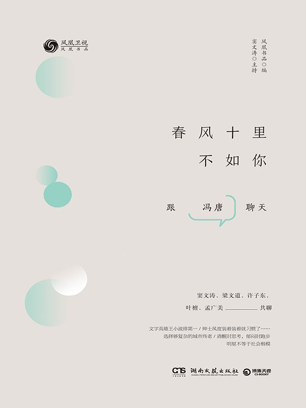

# Tidbits by Chujian Xiao'er (17)

## 0
今天的话题与英文关系不大，暂且算“初见小二的英文日常”的一个番外篇吧。

## 1
小菲菲的爷爷去世了，我们一家三口回老家奔丧，这周4天之内在老家和北京之间来了一个round trip （往返旅行）。走的那天，火车7:45就要开车，我们起得很早。刚一上车，小菲菲就抱着闺女补觉，我则开始看书。曾经听人说过，在火车上，看着窗外，会让人产生一种把所有事物都抛在脑后的感觉。我喜欢在火车上看书，可能就是出于这个原因吧。

这次我看的是由凤凰书品推出的《春风十里不如你——跟冯唐聊天》。

## 2
我与冯唐“结缘”，中间的介绍人其实是窦文涛。2015年，窦文涛在PPTV推出了一档视频节目，叫《天天逗文涛》。在一个偶然的机会下，我关注到了这个**日更**的节目，并一发不可收拾地成为了窦文涛的粉丝，用一个更时髦的词说，就是**“迷弟”**。

这个节目他风雨兼程地做了一年之后，就停播了。为了弥补心灵的空虚，我转而关注《锵锵三人行》，这个窦文涛已经主持了19年的节目，大有相见恨晚之感。

每天我有一项必修的日课，就是洗碗。洗碗时，我会朝小菲菲大喊一声：把文涛给我叫来。这时，她就会默契地递上我的手机。我熟练地打开凤凰FM, 开始收听“锵锵”最新的一期节目。在窦文涛和众多嘉宾的陪伴下，我洗干净了一个又一个碗。

## 3
冯唐是“锵锵三人行”的常客之一，拥有完美履历的他，自带光环，不需要“锵锵”的加持。就连我同样喜欢的另一档播客节目《冬吴相对论》的主播吴伯凡，也毫不掩饰对冯唐的欣赏，他曾这样说：我几乎读了冯唐所有的作品，好像除了冯唐，我没有读完过任何一个当代中国作家的作品。（可惜啊，“冬吴”现在也停播了。）

这本书的书名，其实是来自冯唐的一首诗《春》：
> 春水初生  
> 春林初盛  
> 春风十里，不如你  

他的众多title中，必不可少的一个就是“诗人”。他的诗，大都情感炙热，极具个人风格，小二再引用一首：《可遇不可求的事》：
> 后海有树的院子  
> 夏代有工的玉  
> 此时此刻的云  
> 二十来岁的你  

## 4
这本书的内容，实际上是对冯唐参与录制的《锵锵三人行》节目的文字实录。并根据他们的聊天内容，加入了一些further reading（扩展阅读）。小二在阅读过程中做了一些highlight（标注），因为“锵锵三人行”是对话的形式，除了冯唐，下面的摘录还有一部分来自窦文涛和其它嘉宾，一并分享给大家。如无特别标注，均来自于冯唐。

之所以把他们的对话断章取义地收录在此，还是想鼓励大家去阅读原书，开卷有益。由于篇幅的原因，对这个话题的分享，将分为两期。

## 5
- 日子怎么着都是过，阴谋论过是一辈子，阳光点过也是一辈子，可能阳光点心里更舒坦。
- 个体的人性中，有善、有恶、有神圣，单一个体容易平衡，很难呈现大恶，即使出现，也会被其他人迅速扑灭，不会造成大害。而聚合成组织，个体的恶有可能被集中放大、被管理者利用，形成大恶。一旦集体意志形成，机器开动，个体无助，或被机器消灭，或成为机器的一部分，去消灭他人。
- 关于王小波，我的原话是：王小波到底有多么伟大？这是一个问题。王小波确实有非常好的地方，其实在当代文学我自己的三个文字英雄里，排第一的就是王小波。…一个王朔，另一个阿城。我初中高中时期的三个文字英雄，那时候他们都还活着，现在去了一个。
- 学古者昌，似古者亡。宋人写不了唐诗，元人写不了宋词……周树人的文字，凌厉如青铜器，周作人的文字，内敛如定窑瓷器。他们用功的地方不是如皮肉的文字本身，而是皮肉下面的骨头、心肝、脑浆。	 
- 从医生角度看，这个人只要睡觉好，他的健康程度不会特别差。哪怕再累，只要能睡好，基本没问题。	 
- 其实我的拧巴劲儿是有一定逻辑的，我是有些事儿先去做，然后在做的过程中稍稍退半步，想想到底怎么回事儿，最后拿出10%的时间表达。这样的好处是基本上能言之有物，不会自己生编硬造。
- 我不认为诗是应该被嘲笑的。其实咱们都过着庸俗的生活，但总有百分之一甚至千分之一的时候，会觉得咱们好像过着比庸俗高一点的生活，那一瞬间我觉得就是诗。
- 窦文涛：千载之下有知音嘛。我喜欢一个成语叫“周郎顾曲”，话说三国的时候，周瑜精通音律，宴席旁边有人演奏，弹错了一个音，他也不说话，就看了一眼，意思是你弹错了。所谓“曲有误，周郎顾”，他能听出来，咱音盲什么也听不出来。
- 我觉得唐朝有蛮多的外来文化输入，唐朝有些地方跟中国传统不太一样，比如喜欢金银器多过玉器。李氏在太原附近起家，那地方本身就是五胡杂处，所以李氏有一个很开放的心态来处理对外关系。而且唐朝太强大，就敢有一个包容开放的心态。
- 说到底，女人还是要自强：不容易生病的身体、够用的收入、养心的爱好、强大到混蛋的小宇宙。拥有这些不是为了成为女汉子，而是为了搭建平等的基础。自己穿暖才是真暖，自己真暖之后才有资格相互温暖。
- 我现在住的地方还是小时候生活的五平方公里之内——垂杨柳，包括土地、空气、周围的风物，虽然拆了很多，但还有护城河，有天坛、龙潭湖在。这些意象让你反反复复去体会什么是时间，什么是生命，生命应该用来干什么，所以住北京会让我心里感觉更踏实一点。
- 我用我自己的语言读诗，哪怕那个英文是“垂杨柳味”的英文，我也不纠正，大家也就认了。其实你敢于暴露自己弱点的时候，大家挺开心的，觉得这么一个人终于有点弱点了，太高兴了。
- 梁文道：我记得有人写影评，评德国一个大导演法斯宾德的电影，说法斯宾德电影为什么感人呢？因为他勇敢到了一个地步，把自己最虚弱、最卑鄙、最怯懦的那一面都拿出来，坦然地交给大家了。这样真实的状态，我觉得最难。
- 过去古话讲“唯大英雄能本色”，很多人不敢把自己表露出来，是因为他还没有这种天赋，没有这种历练。
- 冯唐：我在讲话这块超级没天赋。我记得很清楚，小学四年级作文得了奖，第一次当众说话，念作文，我站在那儿，深刻地感觉到自己的小腿肚子翻到前面去，一直在抖。后来经过很长时间训练，觉得自己无论从知识积累还是见识等，好像不比一般人差太多，才慢慢有了一点信心。窦文涛：我当年第一次在学校演讲的时候，深刻地感觉到一股暖流顺着左大腿顺流而下（笑）。
- 我自己有过体会，别人可能骂我超级自恋，但有时候真是老天在扶着你的手，让字往下流。
- 所谓故乡，我的定义是你二十岁之前待十年以上的那个方圆五里，你的根在那儿，你的树冠才能开展。
-  “捷径”走多了，正常的路就没人走了，可是世上哪儿有那么多“捷径”？
- 梁文道：在今天中国这种情况下，你很难有趣味跟风雅，就像冯唐讲的，出来吃饭好像总得谈事儿。如果不谈事儿，举个例子，比如我今天看家门口花开了，心想真好，约你俩来看花吧。这种话在今天听起来很暧昧，对不对？如果我约你说，有个项目出来谈谈，那你觉得这很正常，该去，但是约你来看花，你可能搞不明白是什么情况。
- 窦文涛：我认为今天很多人，哪怕他很有知识很懂艺术，但他缺少一种“逸”的状态，飘逸的逸，他放松不下来。
- 其实有两类状态都缺，一类是对大自然、对人世间美好东西的欣赏，比如大家在一起写首诗或弹个曲子，看看花，看看流水，有时候瀑布就在你身边，然后喝喝茶，不见得说太多话，就是坐一坐，问问你好我好，最近怎么样，稍稍开一两句玩笑就过去了。我觉得这种状态非常好，不谈任何事儿，不看手机。另一类也缺，就是那种争一争、骂一骂，就一两个议题大家敞开了说，碰撞交流，有一种智识上的满足和开心的聚会。这种状态跟生意、跟钱、跟功利毫无关系。
