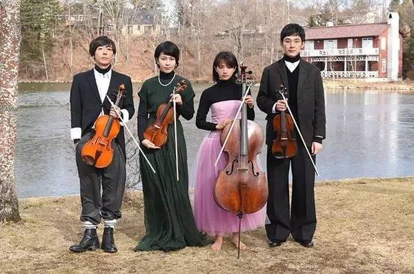
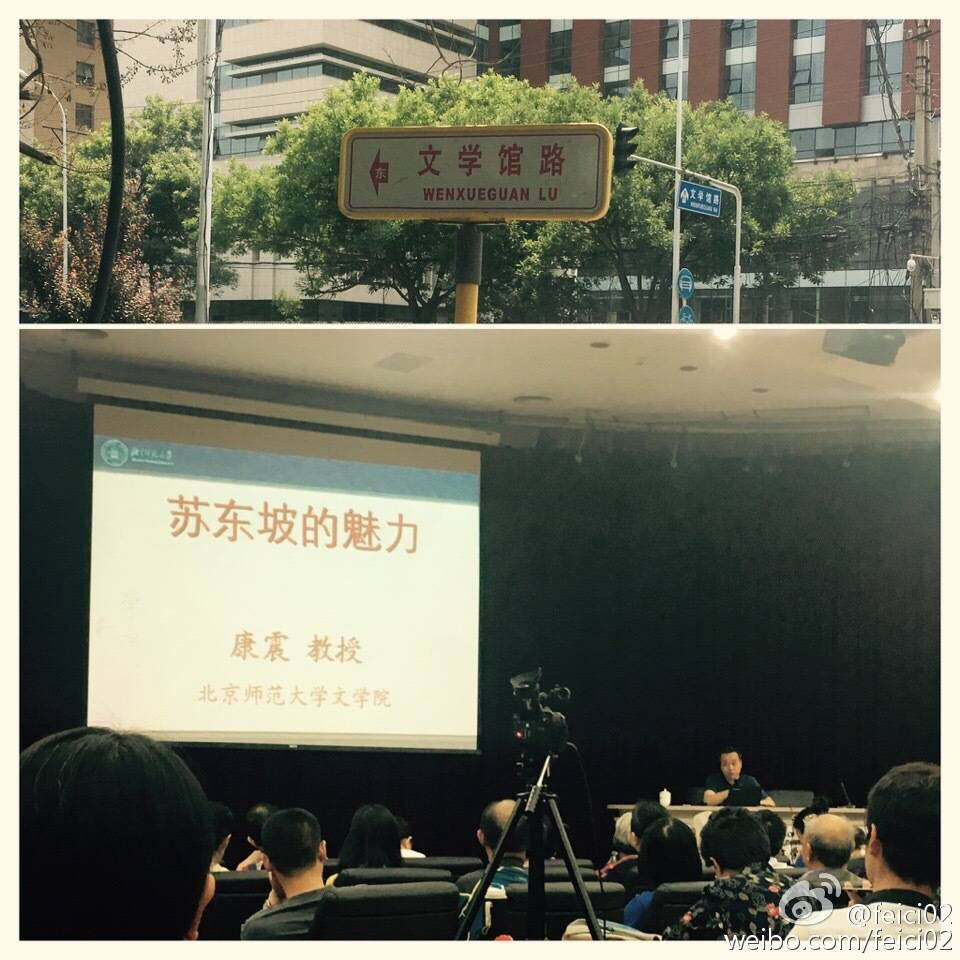

# Tidbits by Chujian Xiao'er (18)

## 0
最近，小二放飞了一下自我：

* 看了两本书：先是趁热打铁，读了冯唐的**《三十六大》**，然后又看了一部小说，马伯庸马亲王的**《古董局中局》**;
* 刷(*binge-watch*)了一部日剧，**《四重奏(Quartet)》**；
* 说走就走了一趟**扬州**。

直接的后果就是导致这篇分享姗姗来迟。My bad. :(

下面是*Quartet*的剧照。前面分享的音乐就是这部剧的主题曲。

## 1
言归正传，本期接着上期的话题，聊一本书**《春风十里不如你——跟冯唐聊天》**。这本书是从冯唐翻译泰戈尔的《飞鸟集》被下架谈起的。引用其中的一首。

原文：
> You smiled and talked to me of nothing and I felt that for this I had been waiting long.

郑振铎译：
> 你微微地笑着，不同我说什么话，  
> 而我觉得，为了这个，我已等待地久了。

冯唐译：
> 你对我笑而不语  
> 为了这句我等了几个世纪

## 2

说到诗词，顺便再谈谈诗词大会。

实际上，在第一季的时候，小二就已经开始关注了。甚至在播出结束后不久，还曾专程去现代文学馆追星，现场聆听了点评嘉宾康震老师的一场讲座。

相比较而言，第二季的诗词大会引起了全社会更广泛的关注。在一片叫好声中，小二也看到了一些批评的文章，听到了一些不一样的声音，比如：**《诗词大会》之后，我们最不该做的是逼孩子去背诗。**

小二觉得对一件事情有不同的看法，是一件好事。我们每一个人的头脑中，应该有不同的观点去左右互搏。但在这件事情上，小二还是会选择和女儿一起读诗，背诗。况且，最近马爷马未都也在他的《观复嘟嘟》中提到，我们每个人都应该背100首古诗词。这就更加坚定了我对自己选择的信心。

诗词到底有什么用呢？就说最近小二与小菲菲的一次对话吧。

## 3
前不久，小菲菲的爷爷以95岁的高龄无疾而终，是喜丧。但当我们开车快行驶到老家的院子时，她还是突然对我说：“心情有些沉重。”我说：“近乡情更怯”。之后，我们都没有说话。但我想，那一刻，她一定能感受到我对她的理解。这就是诗词的魅力吧。

> 渡汉江  
> ——宋之问  
> 岭外音书断，经冬复历春。  
> 近乡情更怯，不敢问来人。  

## 4
下面是剩下的书摘：

1. 窦文涛：我想起阿城老师给我讲《论语》，他讲得特有意思，说我们老以为孔子是一个忧国忧民的思想家，其实《论语》里最有名的一段是孔子问他的几个学生你们喜欢干吗，有人说我喜欢做一个礼官，有人说我喜欢治国，最后一个人讲“冠者五六人，童子六七人，浴乎沂，风乎舞雩，咏而归”，就是到大自然中去飘逸、去洗澡，最后唱着歌回家，而孔子最欣赏的是这种理想。阿城就说，其实孔子所说的人的觉醒，指一个儒者他的内心是自由的。

1. 梁文道：今天大部分职场里的人想的都是提早退休，他们把工作跟休闲分成人生的两个阶段，现在属于工作忙碌的阶段，所有的闲情逸致留给后半生，并且为了要让后半生闲的时间够长、闲得够好，我现在得特别忙。但是终于有一天能够去休闲了，很多人就得抑郁症了，有一天他提早退休，发现自己已经不懂得怎么闲了。  

1. 窦文涛：所以陶渊明就讲“误落尘网中，一去三十年”，终于归隐田园的时候，“舟遥遥以轻飏，风飘飘而吹衣”，心情欢欣鼓舞，我要回家了，总算离开那个乌烟瘴气的官场了。咱们现在特别爱说什么接地气，你要挣钱就得接地气，可老实讲这个地气很多时候就是乌烟瘴气。

1. 冯唐谈退休后的打算。第五，开个旧书店。刘白羽《红玛瑙集》的第一版和凯鲁亚克《在路上》的第一版一起卖，叶医生的明式家具图谱和Jessica Rawson的玉书一起卖。夏天要凉快，冬天要暖和。最好生个蜂窝煤炉子，炉子里烤红薯，上面烤包子，吃不了的，也卖。

1. 很多东西过去你遵循，然后照着去做，最后这些东西把你带到了今天的境地，但是今天再去看，过去那些不见得是对的。  

1. 人是很贱的动物，如果一个东西很无聊，一个特别好的办法是把它变成比赛。你给它设个目标，它就会变得很有意思，	  

1. 我忽然坦然，我心里想和他说的是，我忽然明白了，人生其实到处马拉松，特别是在最难、最美、最重要的一些事情上。  

1. 我第一个全马是在法国波尔多跑完的，喝完，跑完，领完奖牌和一瓶胜利酒，我坐在马路牙子上，慨叹生不如死。旁边一个小孩子拿着手机狂打电子游戏，偶尔斜眼看我，我听见他的心里话：“你傻×啊。” 我忽然坦然，我心里想和他说的是，我忽然明白了，人生其实到处马拉松，特别是在最难、最美、最重要的一些事情上。

1. 人生苦短，想不开的时候，跑步，还想不开，再多跑些，十公里不够，半马，半马不够，全马。

1. 跑步有一段很好的独处的时间，这对于我现在的状态特别难得。把手机放下，完全放开、清空一切事物，自己一个人跟自己的身体在一起，这个东西我觉得挺重要。  

1. 冯唐谈戒手机。可以从两个小习惯开始，一个是吃饭的时候不看手机，特别是和别人在一块儿吃的时候，大家出来吃饭干吗还看手机啊？要是这样，不如自己回家吃饭就完了，对吧？第二是睡觉前不看手机，哪怕看书、背诗也不要看手机。	  

1. 西方有一句话叫“欲戴皇冠，必承其重”。

1. 医疗教育不是说教育医学院的医生、护士、学生，而是教育普通老百姓健康管理应该是什么样的、药的基本用法等等。我们没有这些东西，原因很复杂，一大因素是医生资源严重不足。  

1. 医疗教育不是说教育医学院的医生、护士、学生，而是教育普通老百姓健康管理应该是什么样的、药的基本用法等等。我们没有这些东西，原因很复杂，一大因素是医生资源严重不足，你看个病，五分钟就给你打发出来。你要是感冒，医生不会给你说感冒有病毒性的、细菌性的，病毒性的感冒你吃这种抗生素可能没用，他没时间给你讲那么多。而医疗资源多的地方，你看个医生可能要聊上半小时甚至一小时，这时候潜移默化你就受到了教育。

1. 他们有个笑话嘛，关于“莆田系”的三句话：第一句，病很重；第二句，能治好；第三句，得花钱。

1. 事物总还是要回归本质，我一直认为真大于善，善大于美，否则你的美就是假美，善就是伪善。  

1. 有时候看到报纸上一些评论、采访，称赞某个学者、作家、领导，说这个人很厉害，叫大家要说真话……你想想看，一个社会一天到晚称赞一个人了不起是因为他说了真话，这是什么意思？就是其他人全在说谎话嘛。当这个国家今天还把说真话当成称赞一个人的理由、一种很了不起的品德时，你想我们的社会是处于什么状况下？

Have an amazing day!  
See you soon.
