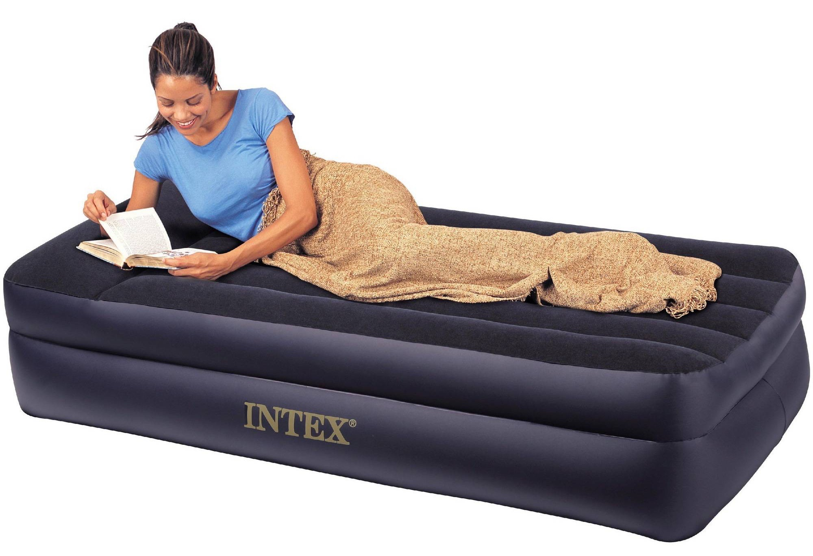

# Tidbits by Chujian Xiao'er (19)

## 0
本期推荐的歌曲是来自Linkin Park的新歌***Heavy***. 其中有一句歌词是：
> Why is everything so heavy?

那么,小二今天的分享就要轻量级一些，它由5条bite-size的信息组成，主要和几个品牌的名称有关。

> bite-size:  
> of a size that can be eaten in one bite

顾名思义，bite-size就是我们可以一口吃掉的大小。在当今社会，我们每一个人的空闲时间都趋于碎片化。采用这样的形式，就是希望大家阅读起来，不会有太大的压力。近日，《逻辑思维》也停止了视频节目的更新，转变成了一档每期5-8分钟，周一到周五日更的音频节目。也是出于同样的考虑。

## 1 TIL
> TIL:   
> Today I learned

它其实是社交网络上的一个话题，大家如果在微博搜索#TIL#, 就可以看到不同的人分享的自己今天学到的东西。目前，“终身学习”的概念被越来越来越多的人所接受。小二觉得在学习的过程中，一定要找到一个适合自己的方式去输出。把每天get到的新技能，用#TIL#这个tag分享在社交网络上，不失为一种便捷的输出方式。

## 2 TOYS"R"US
前段时间，有朋自长沙来，我们和她相约在王府井apm吃饭。饭后，路过了同在这个商场的“玩具反斗城”。经常给孩子买玩具的家长朋友，对这个品牌一定不会陌生。下面是它们的logo.

它的英文实际上是Toys are us, 只不过中间的are用一个反写的字母R代替了。这可能就是中文把它翻译成“反斗城”的原因吧。玩具就是我们，很霸气，有木有？

## 3 Airbnb
随着民宿的兴起，我们在外出旅行住宿时多了一种选择。而Airbnb一度成了民宿的代名词。
关于它名字的来历，小二在国外著名的问答网站Quora（相当于我们的“知乎”）上看到了这个答案：

> The origin of the name can be found in the founders' story: a combination of "airbed" (the scrappy solution Brian and Joe had to adopt in order to host their first guests in their very home) and "bed and breakfast" (or "BnB", a way of hosting in which guests receive a warmer hospitality than hotels).

Brian and Joe是Airbnb的三位联合创始人中的两个。airbed和BnB，对我们来说，都相对比较陌生，小二调查了一下。

> **What's airbed?**  
> A bed that is inflated with air and used as a permanent or temporary bed. They are adjustable, and sometimes portable.

> **What's BnB (or B&B)?**  
A bed and breakfast (typically shortened to B&B) is a small lodging establishment that offers overnight accommodation and breakfast. Bed and breakfasts are often private family homes and typically have between four and eleven rooms, with six being the average. A normal B&B usually have the hosts in the house.

简单地说，就是有主人在家，能够为旅行者提供住宿和早餐的民宿。因为在国内，我们的房子都没那么多的房间，所以这种形式并不多见。

## 4 depot
这也是最近学到的一个词。

> depot:  
a place for storing goods or motor vehicles

在美国，有两家公司的名字中都用了这个词：

* Home Depot
* Office Depot

它们分别是卖家装建材和文具、办公室用品的，感觉有点像我们的百安居和晨光文具, 哈哈。

## 5 Night Shift
本周，小二将自己的MacBook Pro升级到了最新的版本：macOS Sierra 10.12.4. 升级完成后，首先enable的就是在iOS上很早之前就有的一个feature: Night Shift. 现在苹果也把它移植到了最新版本的macOS上。

以下是有关Night Shift的介绍：

> Night Shift automatically shifts the colors of your display to the warmer end of the color spectrum after dark.  

> Studies have shown that exposure to bright blue light in the evening can affect your circadian rhythms and make it harder to fall asleep. Night Shift uses your computer's clock and geolocation to determine when it's sunset in your location. It then automatically shifts the colors in your display to the warmer end of the spectrum. In the morning it returns the display to its regular settings.

也就是说，这个功能会在日落之后，将屏幕发出的光调整到光谱中的暖光区，减少蓝光的成分，从而避免蓝光对人睡眠的影响。

Please refer to the following link for more details:  
https://support.apple.com/en-us/HT207513

这里的shift是move的意思，在编程中有一种运算叫位运算，它有两种操作：左移位（left shift, 用<<表示）和右移位（right shift, 用>>表示). 但night shift更常用的一个意思是指”夜班”。比如，我下周要值夜班，就是：

>I will work the night shift next week.

That's all for today.
Bye for now, see you next time.

## The end.

每天进步一丢丢
